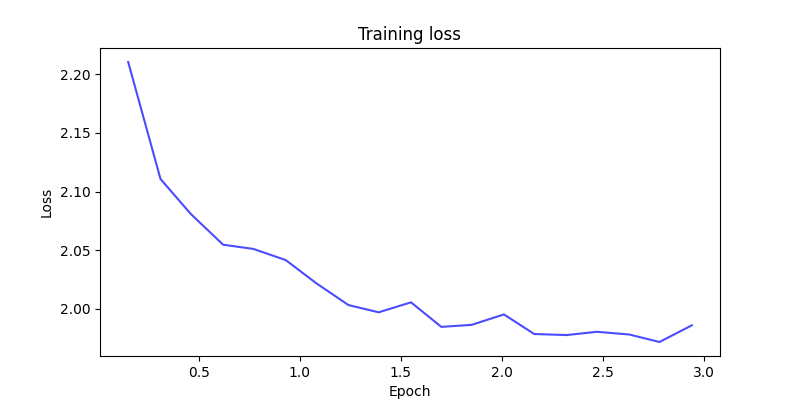

# GPT-2 alpaca clean

This repository contains a finetuned version of the GPT-2 language model, 
trained on the [alpaca-cleaned](https://huggingface.co/datasets/yahma/alpaca-cleaned)
dataset. The alpaca-cleaned dataset is a cleaned and filtered version of the 
Stanford Alpaca dataset. The model showed improvements on instruction related tasks.


## Model Details

The GPT-2 model was finetuned using the Hugging Face Transformers library on the alpaca-cleaned dataset. The finetuned model can be used for various natural language processing tasks, such as text generation, summarization, and question answering.

## Usage

To use the finetuned model, you can load it using the Hugging Face Transformers library. Here's an example:

```python
from transformers import AutoModelForCausalLM, AutoTokenizer

model_name = "Rjonah321/gpt2-alpaca-clean"
tokenizer = AutoTokenizer.from_pretrained(model_name)
model = AutoModelForCausalLM.from_pretrained(model_name)

input_text = "Write a short story about a dog."
input_ids = tokenizer.encode(input_text, return_tensors='pt')

output = model.generate(input_ids, max_length=200, do_sample=True, top_k=50, top_p=0.95, num_return_sequences=1)
generated_text = tokenizer.decode(output[0], skip_special_tokens=True)

print(generated_text)
```

## License
This project is licensed under the MIT License - see the [LICENSE](LICENSE) file for details.

## Acknowledgements
```
@misc{alpaca_cleaned_2023,
author = {Yahma},
title = {Alpaca-cleaned Dataset},
year = 2023,
url = {https://huggingface.co/datasets/yahma/alpaca-cleaned},
note = {Accessed: 2024-06-19},
license = {CC-BY-4.0}
}
```